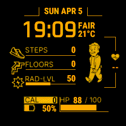
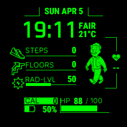
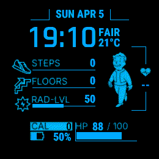
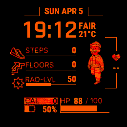
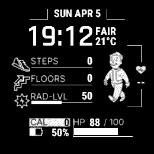

# Garmin VaultBoy Watch Face

A Fallout / Pip-Boy inspired watch face for the **Garmin Fenix 8 Solar 47mm** featuring an animated walking Vault Boy and a retro terminal UI.

Available in five colors — pick the one that matches your style and install it directly from the Garmin Connect IQ store.

---

## Screenshots

| Amber | Green | Blue | Red | White |
|-------|-------|------|-----|-------|
|  |  |  |  |  |

---

## Features

- **Animated Vault Boy** — 9-frame walk cycle
- **Time & Date** — large digital clock with day/month display
- **Heart Rate** — live reading updated every ~1 second
- **Steps & Floors** — with progress bars, updated every 3 seconds
- **Solar Intensity** — 5-minute rolling average with progress bar
- **Body Battery** — updated every ~2.5 minutes
- **Battery Level** — percentage with fill indicator, updated every ~2.5 minutes
- **Calories** — updated every ~2.5 minutes
- **Weather** — current temperature and condition, updated every ~2.5 minutes

---

## Installation

This watch face is not available on the Garmin Connect IQ Store. Installation requires sideloading.

1. Install the [Garmin Connect IQ SDK](https://developer.garmin.com/connect-iq/sdk/) and VS Code with the Monkey C extension.
2. Clone this repo and open the color folder you want (e.g. `VaultBoy_green/`) in VS Code.
3. Run **Monkey C: Build Current Project** to compile.
4. Transfer the resulting `.prg` file to your watch via Garmin Express or USB.

> Note: sideloaded watch faces do not show a Customize button in the watch face menu.

---

## Compatibility

Garmin Fenix 8 Solar 47mm (MIP 280×280)

---

## Disclaimer

This watch face — including all code, logic, and structure — was generated entirely by **Claude**, an AI assistant made by [Anthropic](https://www.anthropic.com). The human author provided direction, feedback, and testing on real hardware; all implementation was written by the AI.

This project is not affiliated with, endorsed by, or connected to Bethesda Softworks, the Fallout franchise, or Garmin Ltd. Vault Boy is a trademark of Bethesda Softworks LLC.

---

## Project Structure

```
VaultBoy_amber/    — Amber (#FFBF00) standalone project
VaultBoy_green/    — Green (#00FF00) standalone project
VaultBoy_blue/     — Blue  (#00BFFF) standalone project
VaultBoy_red/      — Red   (#FF3000) standalone project
VaultBoy_white/    — White (#FFFFFF) standalone project
screenshots/       — Preview images
```
